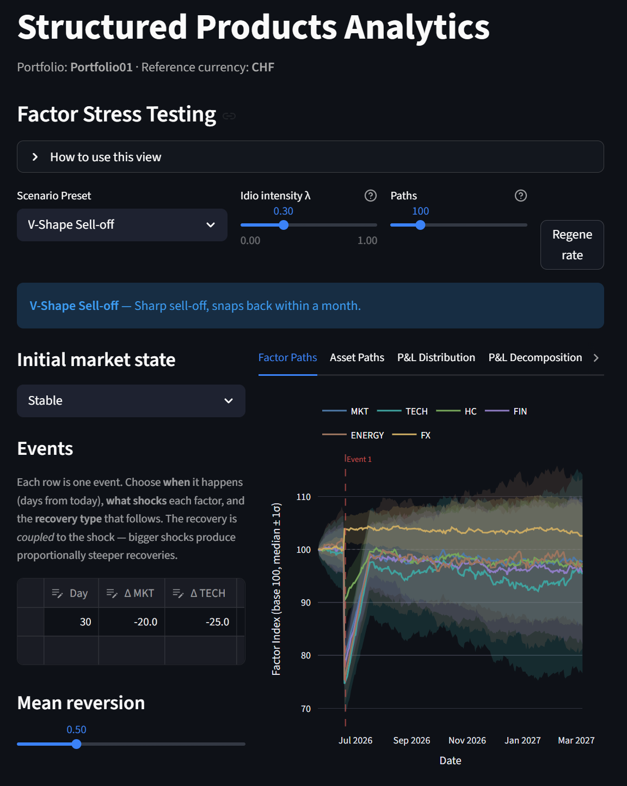

# Structured Products Analytics

This repository contains a growing set of tools and models for analyzing structured products, with a focus on reverse convertibles and multi-asset structures.

The project is designed to build a modular analytics framework combining product-level valuation, portfolio insights, and scenario-based risk analysis.

---

## Dashboard

The project includes an interactive dashboard designed to explore structured products at both product and portfolio level.

---

## Live App

[Open the dashboard](https://struxq.streamlit.app/)

---

## Current Functionality

### Product Modeling

- Standardized representation of structured products (BRC, MBRC) in a unified data model  
- Object-oriented payoff modeling via dedicated product classes  

### Product-Level Analytics

- Payoff and redemption logic (including barrier conditions)  
- Profit & Loss and return metrics  
- Time to maturity and annualized return  
- Worst-of underlying identification for multi-asset structures  

### Portfolio-Level Analytics

- Aggregation of total payoff, cost, and P&L  
- Portfolio return metrics across currencies  
- Underlying look-through and exposure analysis  
- Maturity profiling and concentration views  

### Scenario & Stress Testing

The framework supports two complementary approaches:

**1. Instantaneous Shock Model**
- Direct shock applied to current spot levels  
- Fast sensitivity analysis  

S_final = S_current * (1  beta * shock)

**2. Path-Based Scenario Model**
- Time-consistent evolution of underlying prices  
- Supports delayed shocks and recovery dynamics  **2. Path-Based Scenario Model**
- Day-by-day GBM simulation from today to product maturity
- Shock events snapped to the nearest business day
- Per-underlying beta scaling and annualised volatility (GBM noise)
- Three drift phases: pre-shock, between shocks, post-shock
- Single source of truth: terminal path price drives both payoff and chart
 
Additional features:
- Physical vs cash settlement modeling
- Delivered stock aggregation with weighted pricing
- Cash redemption tracking
- Scenario matrix across multiple market environments
 
### Market Data
 
- Live price fetch via EOD Historical Data API
- Local CSV cache — API called only when previous trading day is missing
- FX conversion to reference currency via Frankfurter API
- Valuation date displayed in Product and Portfolio views
 

 
## Next Steps
 
- Monte Carlo payoff distribution
- Greeks and risk decomposition
- Correlation-aware worst-of modelling
---
