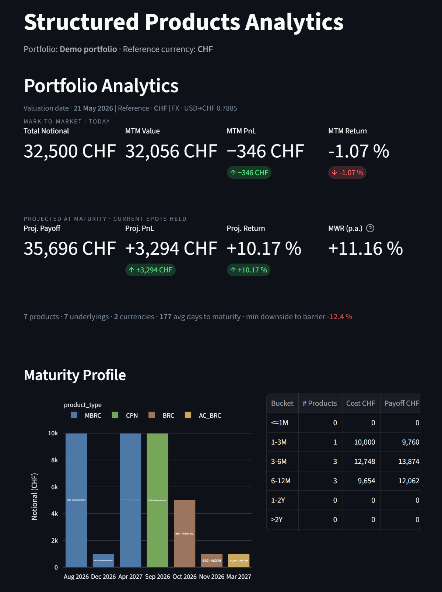
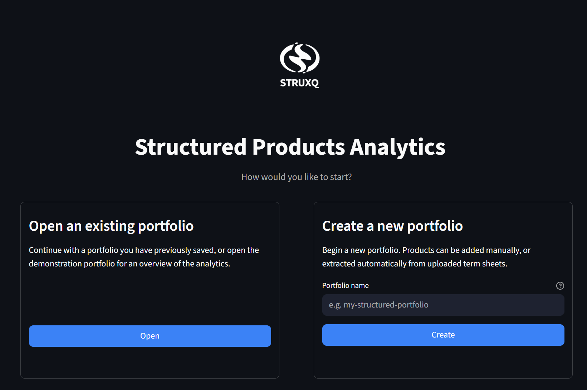
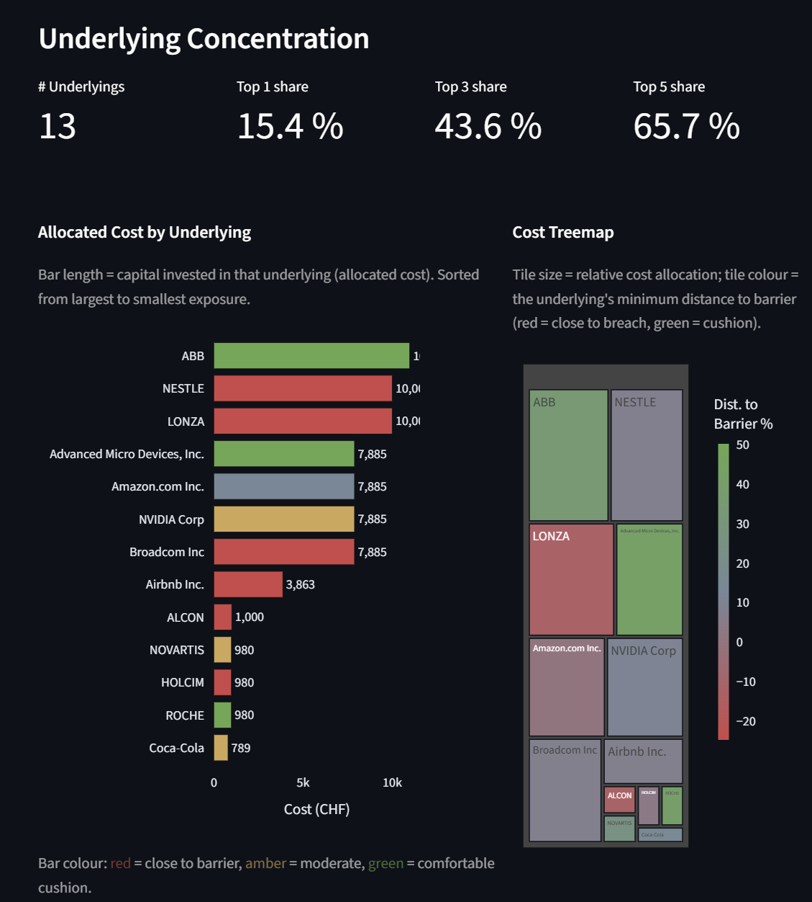
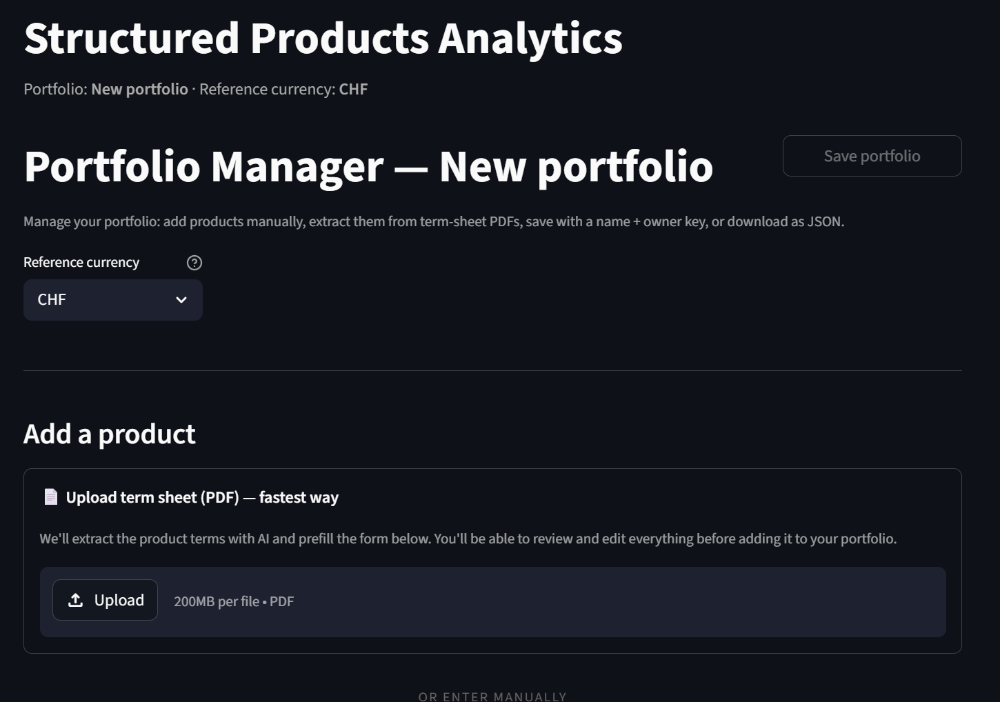

# Structured Products Analytics

A Python analytics framework for monitoring, valuing and stress-testing
portfolios of structured products — Barrier Reverse Convertibles (BRC),
Multi-asset worst-of (MBRC), Autocallable BRC (AC_BRC) and Capital
Protection Notes (CPN).

The project is designed from a **buy-side portfolio analytics
perspective**: payoff transparency, risk monitoring, scenario analysis
and reporting — not sell-side issuance pricing.


---

## Check out live app under: 

[Open the dashboard](https://struxq.streamlit.app/)

---

## Why this exists

Structured products are difficult to monitor because their payoff
depends on several interacting components — underlying price
performance, barrier distance and breach status, coupon accrual,
worst-of logic, time to maturity, currency exposure, autocall
observation schedules, capital-protection floors and physical-delivery
risk.

This framework makes those risks transparent at both **product** and
**portfolio** level, and lets users assemble their own portfolio
(or load a saved one) for in-depth analysis.

---

## What you can do with it

### 1 · Build or load a portfolio

On launch, the app asks you to either continue with an existing
portfolio or create a new one.



Three sources for an existing portfolio:

- **Demonstration portfolio** — a pre-populated set of seven
  representative products for evaluation. Read-only.
- **Saved portfolios** — server-side portfolios stored under
  `data/user_portfolios/<slug>.json` 

- **Upload from file** — restore a portfolio from a previously
  downloaded JSON.

### 2 · Add structured products manually




Per-product **Edit** and **Delete** controls let users curate the
portfolio before saving.

### 3 · Run analytics on the active portfolio

Once the portfolio is loaded, four analytics views are available from
the sidebar — Product, Portfolio, Stress Testing and Factor Stress. The
portfolio name and reference currency appear under the page title on
every view, so it is always clear *which* portfolio is being analysed.



### 4 · Extract products directly from term sheets (AI-assisted)

Upload a structured-product term sheet PDF and the application extracts
the row fields via the Gemini API. Extracted data prefills the manual
entry form so the user only has to confirm the trading-side fields
(`position_units`, `cost_price`, `purchase_date`).




---

## Key features

### Product-level analytics

- Payoff decomposition into coupon and redemption components
- Barrier monitoring and distance-to-barrier metrics
- Worst-of logic for multi-asset reverse convertibles
- Autocall observation schedule and trigger evaluation
- Capital protection floor and participation upside (CPN)
- Performance versus strike; projected payoff at maturity
- Product-level P&L, return, annualised return, YTM

### Portfolio analytics

- Aggregated portfolio P&L and return
- Exposure by product, currency and underlying (look-through)
- Worst-of concentration analysis
- Maturity profile and cash-flow overview
- Multi-currency normalisation into a user-selectable reference currency

### Mark-to-market

- Fair value via Monte Carlo pricer with finite-difference Greeks
- Comparison of projected (hold-to-maturity) value versus fair value

### Multi-factor stress engine

- Factor-based scenario simulation using six liquid risk factors
  (MKT, TECH, HC, FIN, ENERGY, FX)
- Factor loadings estimated via multivariate regression
- **Regime-conditional drifts**: per-factor historical premiums cached
  to `data/factor_premiums.csv`, derived from MKT trailing-12-month
  return conditional means (bear / stable / moderate bull / strong
  bull).

- Mean-reverting log-price dynamics; correlated factor shocks;
  configurable idiosyncratic noise; Common Random Numbers for scenario
  comparison.

### Risk sensitivities

- Delta (per underlying and aggregated)
- Vega, Theta, Rho
- Correlation sensitivity for multi-asset products
- Portfolio aggregation of sensitivities

### Market data integration

- Historical and latest price fetching via EOD Historical Data
- Local market-data storage with refresh logic
- Securities master data
- FX conversion for multi-currency reporting
- Historical correlation estimation from stored prices
- Implied volatility map from EOD / Yahoo options chains

### Portfolio management

- Three entry methods (manual / PDF / saved JSON)
- Per-product edit and delete
- Public named storage with owner-key write protection
- Download as JSON for offline backup
- Reference-currency selector at the portfolio level

---

## Architecture

The framework is modular: product logic, portfolio analytics, market
data, scenario simulation and visualization are independent.

### Core components

| Module | Responsibility |
|---|---|
| `ReverseConvertible` | Payoff, barrier, redemption logic for BRC / MBRC / AC_BRC |
| `CapitalProtectionNote` | Analytic pricing (ZCB + scaled BS call), payoff, summary for CPNs |
| `PortfolioAnalytics` | Portfolio aggregation, look-through, FX normalisation |
| `ScenarioEngine` | Single-factor path-based scenarios with correlated shocks |
| `FactorScenarioEngine` | Multi-factor stress; factor paths projected to asset returns via loadings |
| `FactorPremiums` | Regime-conditional historical drift cache + lookup |
| `MarketDataEngine` | Price fetching, securities master, refresh logic |
| `CorrelationEngine` | Realised correlation matrices from price history |
| `FactorLoadingsEngine` | Multivariate-regression factor loadings per asset |
| `MonteCarloPricer` | Fair value and finite-difference Greeks |
| `TermSheetExtractor` | Gemini-API extraction of term-sheet PDFs into row dicts |
| `PortfolioSource` | Single dispatcher for the active portfolio (demo / user) |
| `PortfolioStorage` | Named, public, owner-key-protected portfolio persistence |
| `Streamlit App` | Onboarding gate, sidebar navigation, four analytics views, portfolio manager |

---

## Example analytics

### Portfolio overview
Total cost, projected payoff, P&L, return, product weights,
currency-level aggregation, reference-currency portfolio value.

### Product view
Product terms, underlying performance, worst underlying, barrier
distance, days to expiry, projected payoff, return and annualised
return, fair value vs projected.

### Risk view
Underlying look-through exposure, barrier proximity, worst-of
concentration, product- and portfolio-level Greeks, correlation
sensitivity.

### Scenario analysis
Simulated underlying price paths, mean path with dispersion bands,
terminal payoff distribution, scenario P&L distribution,
delivered-stock reporting under physical settlement.

---

## Use cases

- Monitoring structured product portfolios
- Understanding payoff behaviour of barrier and capital-protection
  structures
- Stress testing product and portfolio outcomes against historical
  regimes
- Estimating downside exposure and physical-delivery risk
- Comparing projected hold-to-maturity value with fair value
- Building educational tools for structured products and derivatives
- Prototyping analytics logic for structured-product portfolio
  management

---

## Installation

```bash
git clone https://github.com/sanyalelizabet/structured-products-analytics.git
cd structured-products-analytics
pip install -r requirements.txt
```


### Run

```bash
streamlit run app/streamlit_app.py
```

---

## Project layout

```
.
├── app/                          Streamlit UI
│   ├── streamlit_app.py          Entry point + onboarding gate + sidebar
│   ├── portfolio_source.py       Active-portfolio dispatcher (demo / user)
│   ├── portfolio_storage.py      Named portfolio persistence (pastebin model)
│   └── views/                    Product / Portfolio / Stress / Factor / Onboarding / Manager
├── src/                          Domain logic
│   ├── reverse_convertible.py    BRC / MBRC / AC_BRC payoff
│   ├── capital_protection_note.py  CPN payoff + analytic pricing
│   ├── portfolio_analytics.py    Portfolio aggregation
│   ├── scenario_engine.py        Single-factor MC
│   ├── factor_scenario_engine.py Multi-factor MC
│   ├── factor_premiums.py        Regime-conditional drift cache
│   ├── factor_engine.py          Factor data wrapper
│   ├── factor_loadings_engine.py OLS factor loadings
│   ├── market_data_engine.py     Price / master / options fetching
│   ├── correlation_engine.py     Realised correlation matrices
│   ├── term_sheet_extractor.py   Gemini PDF → row extraction
│   ├── portfolio_entry.py        Schema-as-code (form, edit dialog, CLI, extractor)
│   └── pricing/                  Monte Carlo + Black-Scholes
├── data/                         Cached market data + saved portfolios
│   ├── prices.csv                Historical prices
│   ├── factor_premiums.csv       Regime-conditional per-factor drifts
│   └── user_portfolios/          User-saved portfolios (one JSON per portfolio)
├── tests/                        pytest suite (530+ tests)
├── notebooks/                    Exploratory + extractor POC
└── figures/                      Documentation images
```

---

## License

This project is for educational and research use. Not investment advice.
